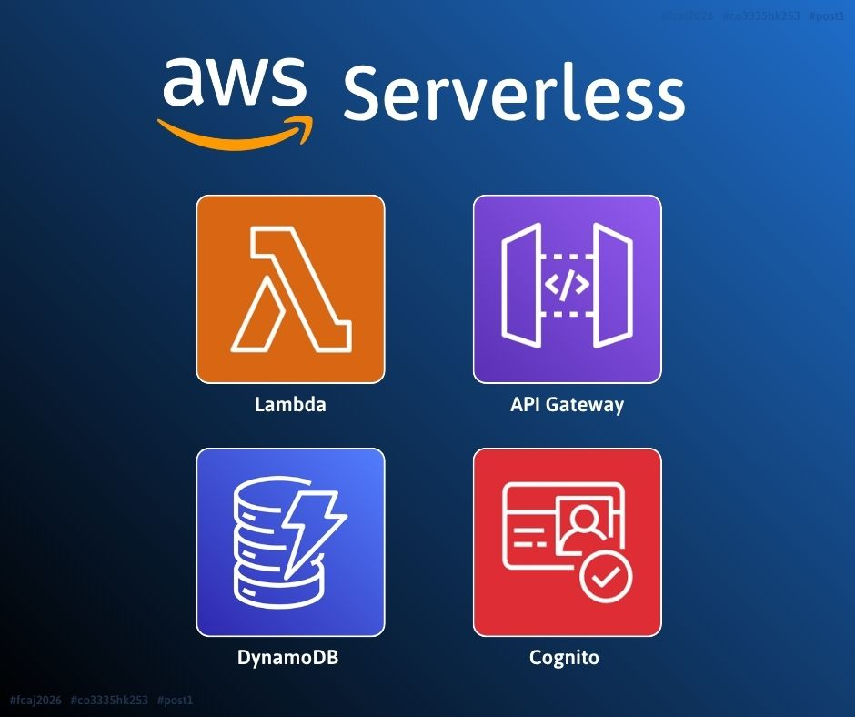

# [LÀM QUEN AWS SERVERLESS: NHỮNG DỊCH VỤ SERVERLESS MÌNH LỰA CHỌN ĐỂ XÂY DỰNG WORKSHOP](https://www.facebook.com/share/1DRhj9K5Lu/)

Mỗi dịch vụ đảm nhận một vai trò riêng nhưng được thiết kế để hoạt động cùng nhau. Khi hiểu được mối liên kết này, mình không còn nhìn Serverless như một công nghệ riêng lẻ mà như một phương pháp thiết kế hệ thống hiện đại, trong đó nhà phát triển tập trung vào nghiệp vụ còn hạ tầng được AWS quản lý.

Các điểm chính cần nắm:

* **AWS Serverless vẫn được vận hành trên các máy chủ của AWS**. Người phát triển không cần trực tiếp quản lý hay cấu hình hạ tầng mà chỉ cần định nghĩa các tài nguyên cần thiết; AWS sẽ tự động triển khai, vận hành và mở rộng phần hạ tầng phía sau.
* **AWS Lambda là dịch vụ tính toán cốt lõi trong hầu hết các kiến trúc AWS Serverless, chịu trách nhiệm xử lý nghiệp vụ của ứng dụng**. Để hệ thống dễ bảo trì và mở rộng, mỗi hàm Lambda nên đảm nhận một nhiệm vụ hoặc một nhóm chức năng có liên quan chặt chẽ, thay vì xử lý quá nhiều nhiệm vụ khác nhau.
* **Amazon API Gateway đóng vai trò là "cổng vào" của toàn bộ hệ thống**. Ngoài việc định nghĩa và công bố API, dịch vụ còn hỗ trợ nhiều tính năng như xác thực bằng JWT, cấu hình CORS, giới hạn tốc độ truy cập (Rate Limiting) và ghi nhật ký các yêu cầu (Request Logging).
* **Amazon DynamoDB là cơ sở dữ liệu NoSQL, và mô hình dữ liệu nên được thiết kế dựa trên Access Pattern**. Cụ thể, khi thiết kế, nên dựa trên cách dữ liệu sẽ được truy vấn và sử dụng trong thực tế, thay vì áp dụng tư duy thiết kế của cơ sở dữ liệu quan hệ truyền thống.
* **Amazon Cognito cung cấp sẵn các chức năng xác thực và quản lý người dùng**. Tính năng này giúp xây dựng hệ thống bảo mật an toàn và đáng tin cậy hơn so với việc tự triển khai cơ chế xác thực hoặc sử dụng các thông tin xác thực được gán cố định (hard-code) trong mã nguồn.

Theo mình, đây cũng là lý do khiến Serverless ngày càng được sử dụng rộng rãi trong các ứng dụng web và di động hiện nay. Mặc dù vẫn tồn tại những hạn chế như Cold Start hay phụ thuộc vào nhà cung cấp dịch vụ, lợi ích về khả năng mở rộng, chi phí và tốc độ phát triển khiến Serverless trở thành lựa chọn phù hợp cho nhiều dự án thực tế, đặc biệt là các hệ thống có lưu lượng truy cập biến động.

Link bài đăng: <https://www.facebook.com/share/1DRhj9K5Lu/>
