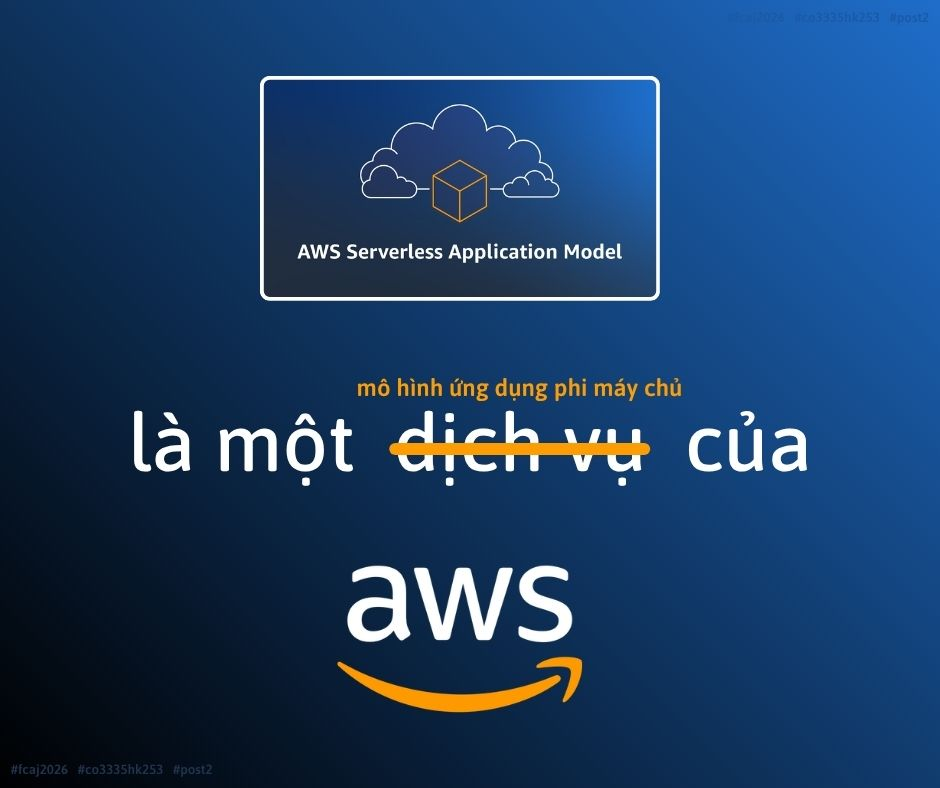

# [WHAT IS AWS SAM? WHY IS AWS SAM NOT CONSIDERED AN AWS SERVERLESS SERVICE?](https://www.facebook.com/share/p/19M2zdKdvg/)

Before starting this project, I used to think that infrastructure deployment was simply the final step after completing the application code. However, working with AWS SAM helped me realize that infrastructure design and application development should be carried out together. Defining the entire system in a `template.yaml` file not only simplifies deployment but also provides significant benefits, including easier maintenance, improved collaboration, version control, and seamless integration with CI/CD pipelines. It also serves as a solid foundation for building scalable systems in real-world environments.

In addition, I came to understand that AWS SAM is not a service that replaces AWS Lambda or Amazon API Gateway. Instead, it acts like an "architect" that describes how different Serverless services are connected before AWS CloudFormation provisions the entire infrastructure.

Key points to know:

* **Infrastructure as Code (IaC) should be adopted** to define the entire infrastructure as source code instead of configuring resources manually through the AWS Management Console. This approach makes infrastructure more consistent, maintainable, shareable, and easier to synchronize across deployment environments.
* **AWS SAM is a framework for developing and deploying Serverless applications using the IaC approach**. It enables developers to define and manage cloud infrastructure as source code, in much the same way that application code is managed.
* **AWS SAM** provides four fundamental commands that are commonly used throughout the development and deployment lifecycle: `sam init`, `sam build`, `sam local`, and `sam deploy`.
* **The `template.yaml` file is the most important component of an AWS SAM project**, as it defines all AWS resources and their relationships, providing a clear and complete description of the application's architecture.
* **AWS SAM is responsible only for building and deploying Serverless infrastructure and applications**. It does not store application data, execute business logic, or replace Serverless services such as AWS Lambda and Amazon API Gateway.

For beginners learning AWS, I believe that understanding the role of AWS SAM provides a much clearer picture of how a complete Serverless application is organized and deployed, rather than focusing on each service in isolation.

Link bài đăng: <https://www.facebook.com/share/p/19M2zdKdvg/>
