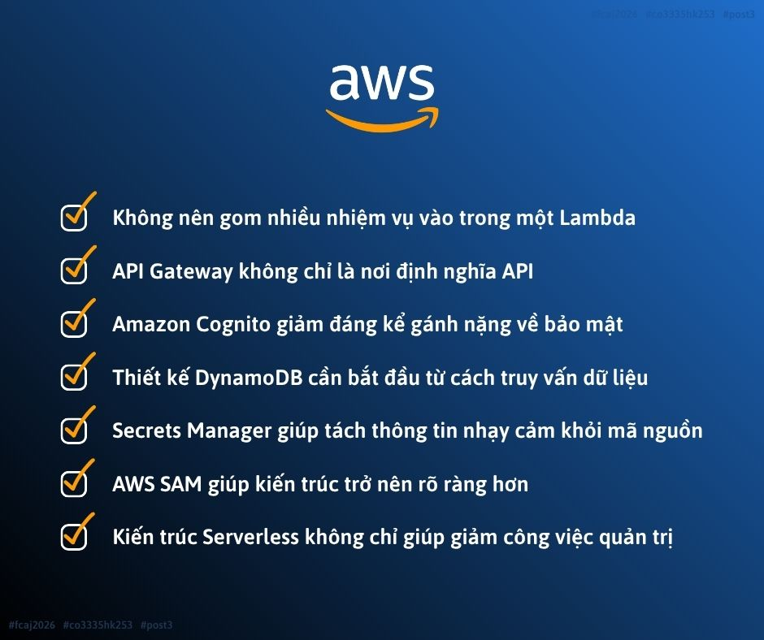

# [LESSONS I LEARNED FROM DESIGNING A SERVERLESS QR ATTENDANCE SYSTEM ON AWS](https://www.facebook.com/share/p/1BkEq1q5fx/)

Key points to know:

* Avoid placing too many responsibilities in a single AWS Lambda function.
* Amazon API Gateway is more than just a service for defining REST APIs.
* Amazon Cognito significantly reduces the complexity of implementing authentication and security.
* DynamoDB data modeling should begin with understanding how the application will query the data.
* AWS Secrets Manager helps separate sensitive information from the application source code.
* AWS SAM makes the overall system architecture more structured and easier to manage.
* A Serverless architecture not only reduces infrastructure management effort but also enables developers to focus more on delivering business value.

This experience helped me understand that designing a Serverless application is not simply about combining AWS services. Instead, it requires careful architectural planning, a clear separation of responsibilities, and the adoption of Infrastructure as Code (IaC) practices to build systems that are scalable, maintainable, and suitable for real-world deployment.

Link bài đăng: <https://www.facebook.com/share/p/1BkEq1q5fx/>
