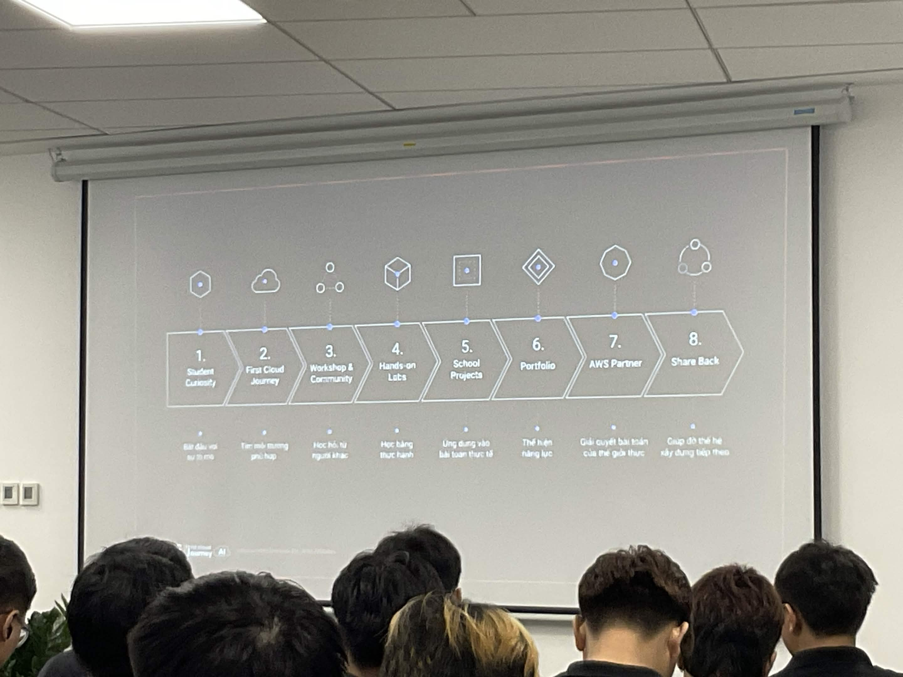
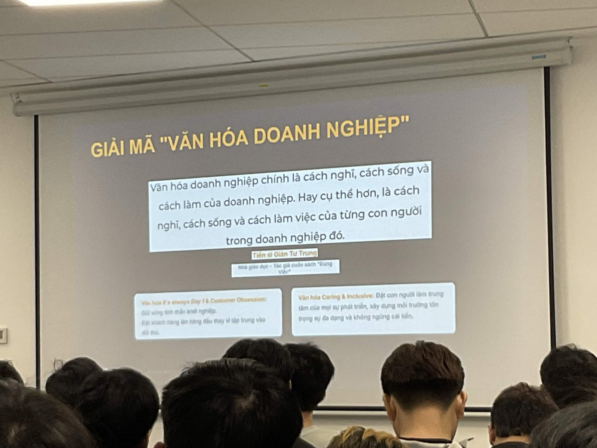

# Bài thu hoạch “FCAJ meetup day 2026”

### Mục Đích Của Sự Kiện
- Chia sẻ góc nhìn thực tế về công việc và trách nhiệm của một DevOps Engineer[cite: 1].
- Hướng dẫn thiết kế kiến trúc hệ thống rút gọn URL có khả năng mở rộng trên AWS[cite: 2].
- Vạch ra lộ trình phát triển từ sinh viên đến AWS Partner và tham gia đóng góp cho cộng đồng[cite: 3].
- Chia sẻ định hướng nghề nghiệp cho Data Analytics Engineer và văn hóa làm việc tại các tập đoàn đa quốc gia (MNCs)[cite: 4].

### Danh Sách Diễn Giả
- **Trong H. Truong** – DevOps Engineer @ Endava Vietnam[cite: 1]
- **Đinh Trung Kiên** – Lead developer at startup[cite: 2]
- **Nguyễn Minh Thọ** – Student[cite: 2]
- **Danh Hoàng Hiếu Nghị** – AI Engineer, AWS Community Builder, AWS Student Builder Group Leader[cite: 3]
- **Đạt Phạm** – Data Analytics Engineer[cite: 4]
- **Cường Nguyễn** – Process Engineer[cite: 4]

### Nội Dung Nổi Bật

#### Công Việc Thực Tế Của DevOps Engineer
- Phạm vi công việc DevOps phụ thuộc nhiều vào bối cảnh như quy mô công ty, cấu trúc team và độ phức tạp của sản phẩm[cite: 1].
- Công việc thực tế không chỉ có viết CI/CD pipeline mà còn bao gồm trực hệ thống (on-call) 24/7, xử lý sự cố, gỡ lỗi, hỗ trợ môi trường và điều tra chi phí tài nguyên[cite: 1].
- Nhấn mạnh tầm quan trọng của nền tảng cơ bản (Linux, mạng, ngôn ngữ lập trình) thay vì chỉ học cách sử dụng công cụ[cite: 1].

#### Kiến Trúc Hệ Thống URL Shortener Trên AWS
- Hệ thống rút gọn URL cơ bản gặp nhiều hạn chế như lỗ hổng bảo mật, độ trễ đọc và điểm nghẽn (single point of failure)[cite: 2].
- Kiến trúc mở rộng sử dụng Amazon CloudFront, Route 53, WAF, Amazon ECS (SpringBoot), DynamoDB và Amazon ElastiCache (Redis)[cite: 2].
- Dịch vụ Key Generation Service (KGS) tính toán trước (pre-generate) các mã ngắn và đẩy vào hàng đợi Redis để việc tạo URL diễn ra tức thì và không bị trùng lặp[cite: 2].
- Luồng đọc dữ liệu áp dụng Cache-aside pattern, ưu tiên đọc từ bộ nhớ đệm trước để giảm thiểu áp lực cho cơ sở dữ liệu và giữ độ trễ thấp[cite: 2].

#### Tư Duy Phát Triển Nghề Nghiệp và Văn Hóa MNC
- Mô hình phát triển cá nhân gồm 5 giai đoạn: Follower (Người thực thi), Learner (Người học chủ động), Problem Solver (Người giải quyết vấn đề), System Thinker (Người tư duy hệ thống) và Super Star (Người dẫn dắt)[cite: 4].
- Data Analytics Engineer cần trang bị tư duy phản biện, kỹ năng giao tiếp, kể chuyện với dữ liệu và khả năng giải quyết vấn đề[cite: 4].
- Văn hóa tại MNCs đề cao "No-Blame Post-Mortem" (tập trung tìm nguyên nhân cốt lõi để sửa hệ thống thay vì đổ lỗi cá nhân) và môi trường "Caring & Inclusive"[cite: 4].
- Hành trình trở thành AWS Partner trải qua 8 bước, bắt đầu từ sự tò mò của sinh viên đến khi áp dụng thực tế và đóng góp ngược lại (Share Back) cho cộng đồng[cite: 3].

### Những Gì Học Được

#### Tư Duy Thiết Kế
- **Separation of Concerns (Tách biệt mối quan tâm):** Tách biệt luồng đọc và ghi để tối ưu hóa theo đặc thù lưu lượng truy cập của từng luồng thay vì dùng chung một điểm nghẽn[cite: 2].
- **Defense at the Edge (Phòng thủ từ rìa):** Đưa bảo mật và bộ nhớ đệm ra càng gần người dùng càng tốt để các mối đe dọa và tải trọng không chạm tới hệ thống lõi[cite: 2].
- **Tư Duy Hệ Thống:** Tập trung tư duy theo cả một hệ thống thay vì chỉ sửa những lỗi lặt vặt[cite: 1].

#### Chiến Lược Nghề Nghiệp
- **Nắm Vững Nền Tảng:** Công cụ có thể thay đổi nhưng nền tảng thì không[cite: 1].
- **Hỏi "Tại sao" Trước Khi Hỏi "Thế nào":** Cần hiểu rõ nguyên nhân gốc rễ của vấn đề thay vì chỉ sao chép câu lệnh[cite: 1].
- **Triết lý "Đúng Việc":** Cân bằng giữa Làm Người (tự quản trị nội tâm), Làm Nghề (có mục đích phụng sự) và Làm Dân (tạo di sản công nghệ cho cộng đồng)[cite: 4].

### Ứng Dụng Vào Công Việc
- **Áp dụng Pre-computation:** Tính toán và tạo sẵn dữ liệu (như cách KGS tạo mã ngắn) để giảm thiểu thời gian xử lý khi có yêu cầu từ người dùng[cite: 2].
- **Triển khai Cache-aside Pattern:** Tối ưu hóa các dịch vụ có lượng đọc lớn bằng cách dùng Redis làm bộ nhớ đệm trước khi truy vấn cơ sở dữ liệu chính[cite: 2].
- **Kể chuyện với dữ liệu:** Biến những con số khô khan thành những câu chuyện có ý nghĩa để thúc đẩy các quyết định kinh doanh[cite: 4].
- **Tham gia cộng đồng:** Tham gia các nhóm AWS Study Group hoặc AWS Community Builder để liên tục học hỏi thực hành và chia sẻ kiến thức[cite: 3].

### Trải Nghiệm Trong Event

Tham gia **FCAJ Meetup Day 2026** là một trải nghiệm rất bổ ích, giúp tôi có cái nhìn toàn diện về thực tế công việc DevOps, thiết kế kiến trúc đám mây AWS và định hướng phát triển sự nghiệp. Một số trải nghiệm nổi bật:

#### Học hỏi từ các diễn giả có chuyên môn cao
- Được lắng nghe những góc khuất thực tế nhưng cực kỳ quan trọng về công việc của một DevOps Engineer, hiểu được vai trò của kỹ năng giao tiếp và nền tảng cốt lõi[cite: 1].
- Tiếp thu kiến thức thực chiến về cách thiết kế một hệ thống đám mây có khả năng mở rộng cao với DynamoDB và ElastiCache[cite: 2].

#### Trải nghiệm kỹ thuật thực tế
- Hiểu được cách giải quyết bài toán trùng lặp mã và độ trễ bằng cách sử dụng dịch vụ tạo mã trước (KGS) và hàng đợi Redis[cite: 2].
- Nhận thức được tầm quan trọng của việc phòng thủ từ rìa (Defense at the Edge) để bảo vệ hệ thống lõi khỏi các nguy cơ bảo mật[cite: 2].

#### Góc nhìn về nghề nghiệp và văn hóa
- Nắm bắt được lộ trình 5 giai đoạn phát triển sự nghiệp để từng bước nâng cao năng lực lên cấp độ Tư duy hệ thống và Dẫn dắt[cite: 4].
- Hiểu rõ quy trình tuyển dụng và tầm quan trọng của văn hóa "No-Blame" tại các tập đoàn công nghệ đa quốc gia[cite: 4].
- Được truyền cảm hứng từ lộ trình 8 bước trở thành AWS Partner và các chương trình cộng đồng sinh viên[cite: 3].

#### Một số hình ảnh sự kiện

> Tổng thể, sự kiện không chỉ cung cấp kiến thức kỹ thuật về kiến trúc hệ thống mà còn giúp tôi thay đổi cách tư duy về định hướng nghề nghiệp, tư duy hệ thống và văn hóa làm việc tại môi trường quốc tế.